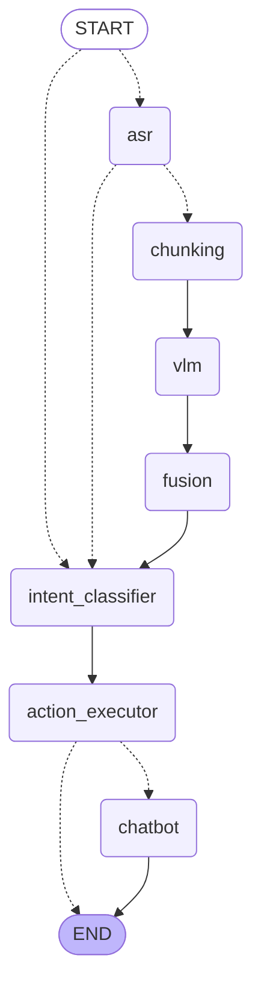

# Project Obsidian Architecture

## 1. Overview
Project Obsidian is a local-first, offline AI desktop application designed to analyze and query short video files. It leverages LangGraph to perform tasks like transcription, vision analysis, and report generation.

## 2. System Constraints & Requirements
- **Offline Only**: No internet connection required for core functionality. (Except to download models)
- **Local Inference**: All models run locally (OpenVINO / Hugging Face).
- **Video Limit**: Optimized for ~1 minute MP4 files.
- **Privacy**: Chat history and data persist locally.
- **Cross-Platform**: Fully supported on Ubuntu (Linux) and Windows.

## 2.1 System Requirements
- **OS**: Linux (Ubuntu 22.04+) or Windows 10/11.
- **Runtime**: Python 3.10+, Node.js 18+, Rust (latest).
- **System Libraries**:
    - `webview2-com-gtk-4.0` (Linux Tauri requirement).

## 3. High-Level Architecture

Here's the architecture of the application (generated using LangGraph) for the backend for every conversation turn.

## 4. Components

### 4.1 Frontend (Tauri + React)
- **Framework**: Tauri (Rust-based) for the application shell.
- **UI Library**: React
- **Responsibility**: 
  - Render Chat UI.
  - Handle file inputs.
  - Display interaction history.
  - Communicate with Python backend.

### 4.2 Backend (Python Orchestrator)
- **Communication**: Connect RPC
- **Responsibility**:
  - Accept requests from Frontend.
  - Manage application state.
  - Route user queries to appropriate agents / nodes.
  - Manage "Human-in-the-loop" clarifications.

### 4.3 Models
- **Chat/Reasoning**: `OpenVINO/Phi-3-mini-4k-instruct-int4-ov`
- **Automatic Speech Recognition**: `openai/whisper-small`
- **Vision**: `HuggingFaceTB/SmolVLM2-500M-Video-Instruct`
  
### 4.4 Tools
> Note: Tools can be found at `backend\app\tools`.
- Audio Tools
  - `get_full_transcript`
  - `export_transcript_srt`
- Generic Tools (Used as learning how to implement tools)
  - `add_numbers`
