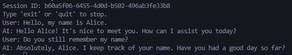
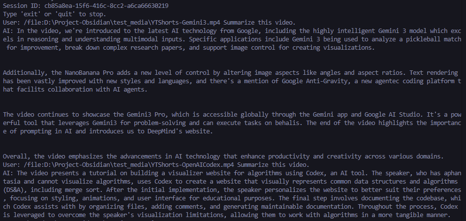
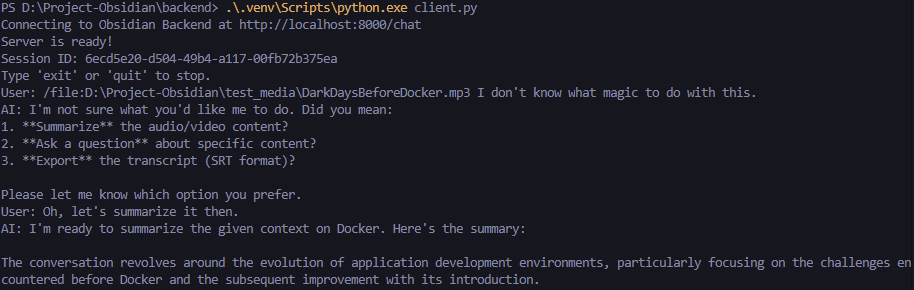
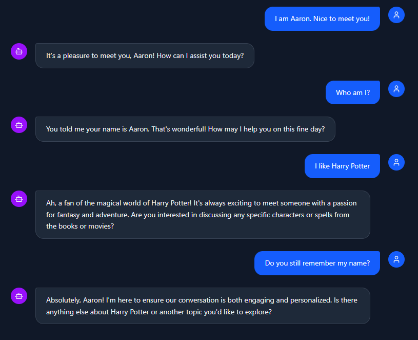
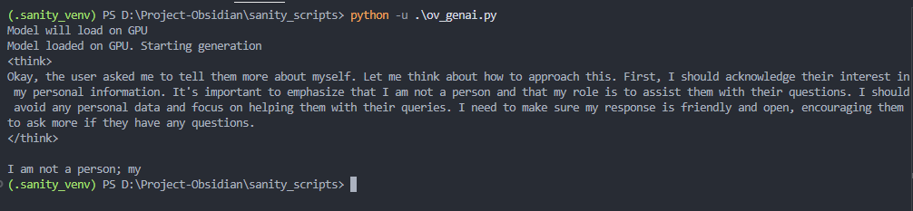
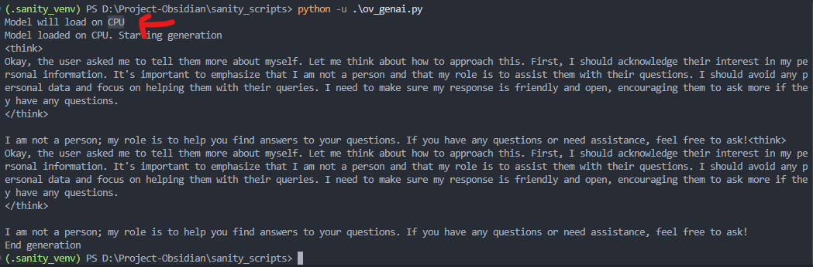

## Work Log / Backlog / Scratchpad

## 2026-01-13 - Connecting Frontend + Backend using ConnectRPC
- Create Frontend / UI
- Connect Frontend UI with Backend using Connect RPC (currently hybrid FastAPI + Connect RPC)

## 2026-01-12 - Chat Persistence
- Add SQLite checkpointer to persist chat history
- Fixed missing general chat intent.

_After sending "Hi, I am Alice", restarted server, and then sent "Do you remember my name?"_

## 2026-01-11 - VLM Support
- Added VLM support to the graph
- Added Fusion Node to fuse ASR + VLM into unified text chunks and store in ChromaDB
- Added Chunking Node to split audio into chunks for ASR

- 🔧 BUGFIX: Reset `media_id` in state whenever we pass in a new file. This forces recomputation of file hash, preventing skipping due to stale / wrong state.

- ⚠️ LIMITATION: Current state cannot compare multiple files effectively.

## 2026-01-11 - Fresh Start 🌱 (Upgraded Arch with Intent)
- Added more heuristics for audio segment usability. Added vocab diversity (unique words), and repeated phrase (potential model hallucinations) ([asr_node.py](asr_node.py))
- Added Intent classification node to handle different types of queries.
- Added Action executor node to handle different types of actions.
- Reduces heavy reliance on LLM / SLM to decide what to do in a single query. Will now classify user intent first, then execute appropriate action. (If user prompt is unclear, will prompt the user for more information)

### 2026-01-10 - Fresh Start 🌱
- Set up ASR / Whisper model for audio transcription. Currently able to return timestamps. For ASR, using OpenVINO GenAI library instead of OpenVINO / Optimum. (Experimentation to figure out if OpenVINO GenAI can provide Whisper confidence scores)
- Create simple heuristics to estimate usability of audio segments.
- Add chatbot (client.py) handling of files through `/file` command.
- Add support for tools (ToolsNode). Created a simple `add_numbers` tool for sanity check.
- Add preliminary ASR pipeline connected to the main chatbot.

- ⚠️ LIMITATION: ASR / Whisper does not return confidence scores (both OpenVINO GenAI / OpenVINO Optimum).
- ⚠️ LIMITATION: When adding files, must have the `/file` command at the beginning of the message.

### 2026-01-09 - Fresh Start 🌱
- Simple chatbot with memory and streaming implemented using LangGraph.
- Using FastAPI (REST based) to communicate between frontend and backend. Future plan is to use ConnectRPC + Tauri.(replace `StreamingResponse` with a ConnectRPC handler.)

- ⚠️ LIMITATION: Chatbot memory is not persistent (no database). Future plan for drop in replacement in LangGraph (swap `MemorySaver` with `SqliteSaver`)

### 2026-01-08 - Fresh Start 🌱
- Removed all frontend code to focus on backend.
- Planned rearchitecture to use LangGraph to coordinate between all tool / agent use.

### 2026-01-08 - v0.4
- Added simple memory (simple sliding window of the past few conversations).
- Switch back to CPU generation (for now). Also switched back to larger SLM (Phi 3 mini).

- 🔧 BUGFIX: Add "onComplete" for to identify whether LLM/SLM is still streaming output. Previously UI was stuck in "generating response" even if generation was complete.
- 🔧 BUGFIX: Fix removed video processing pipeline.

- ⚠️ LIMITATION: Current strategy for video understanding is inadequate. Currently brute forcing every 2nd frame analysis. Lacking in semantic understanding of video.

### 2026-01-08 - v0.3
- Able to get preliminary frontend and backend to communicate. Major issue was with gRPC protos. (See [manual_proto_patches.md](manual_proto_patches.md) and [troubleshooting_proto.md](troubleshooting_proto.md))
- 🐞 BUG: GPU Generation will crash / terminate backend without issue. Reproduced (locally) with [sanity script](..\sanity_scripts\ov_genai.py) (Note there is no "End generation"). **CPU works without issue!**

- ⚠️ LIMITATION: No concept of memory. Current implementation is only QA for 1 turn.

