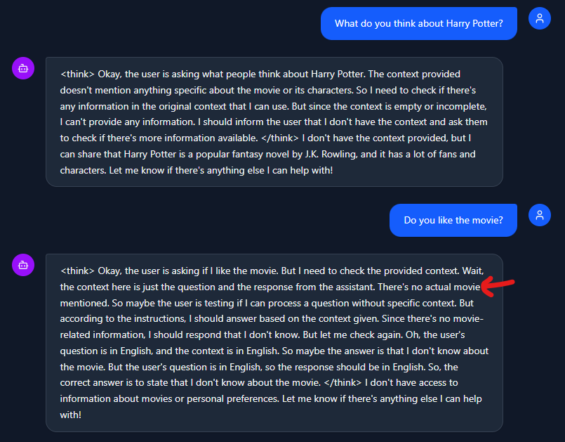

## Work Log / Backlog / Scratchpad

### 2026-01-08 - v0.4
- Added simple memory (simple sliding window of the past few conversations).
- Switch back to CPU generation (for now). Also switched back to larger SLM (Phi 3 mini).

- 🔧 BUGFIX: Add "onComplete" for to identify whether LLM/SLM is still streaming output. Previously UI was stuck in "generating response" even if generation was complete.
- 🔧 BUGFIX: Fix removed video processing pipeline.

- ⚠️ LIMITATION: Current strategy for video understanding is inadequate. Currently brute forcing every 2nd frame analysis. Lacking in semantic understanding of video.

### 2026-01-08 - v0.3
- Able to get preliminary frontend and backend to communicate. Major issue was with gRPC protos. (See [manual_proto_patches.md](manual_proto_patches.md) and [troubleshooting_proto.md](troubleshooting_proto.md))
- 🐞 BUG: GPU Generation will crash / terminate backend without issue. Reproduced (locally) with [sanity script](..\sanity_scripts\ov_genai.py) (Note there is no "End generation"). **CPU works without issue!**

- ⚠️ LIMITATION: No concept of memory. Current implementation is only QA for 1 turn.

